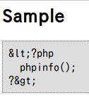
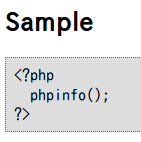

# UnEscMarkdown
unEscape Markdown

## 作った動機

Webの中の一つの文章をMarkdownで記述すると表現力がアップしてわかりやすくなるが、
Javascriptなどのスクリプトが動くのが困る。

Webの中の文章は、出力時にhtmlspecialchars関数で処理するが、Markdownで記述した
文章をhtmlspecialchars関数に通すと、コードを表示する部分が無効化される。

たとえば、以下のような記述では、

    ## Sample
    ```
    <?php
      phpinfo();
    ?>
    ```
このようになる。  


で、コードの中だけ、htmlspecialchars関数での処理を元に戻そうと考えた。

ついでに、引用を示す部分も処理を元に戻す。

## 使い方

### MarkdownExtraのインストール

php Markdown のページ -> [ダウンロード](https://michelf.ca/projects/php-markdown/)

この中のMichelfフォルダをプロジェクトフォルダに入れる。  
phpファイルに以下の記述を入れる。

```PHP
require_once('Michelf/MarkdownExtra.inc.php');
use Michelf\MarkdownExtra;
```
### unEscMarkdownの使い方

さきほどのMarkdownExtra記法の文は、
これが $text に入っているとして、以下のようにする。

```PHP
$newtext = unEscMark(htmlspecialchars($text, ENT_QUOTE, "UTF-8"));
$html = MarkdownExtra::defaultTransform($newtext);

<html><body>
  <?php echo $html; ?>
</body></html>
```
このようになる  


***
&copy; 2018 Seiichi Nukayama
